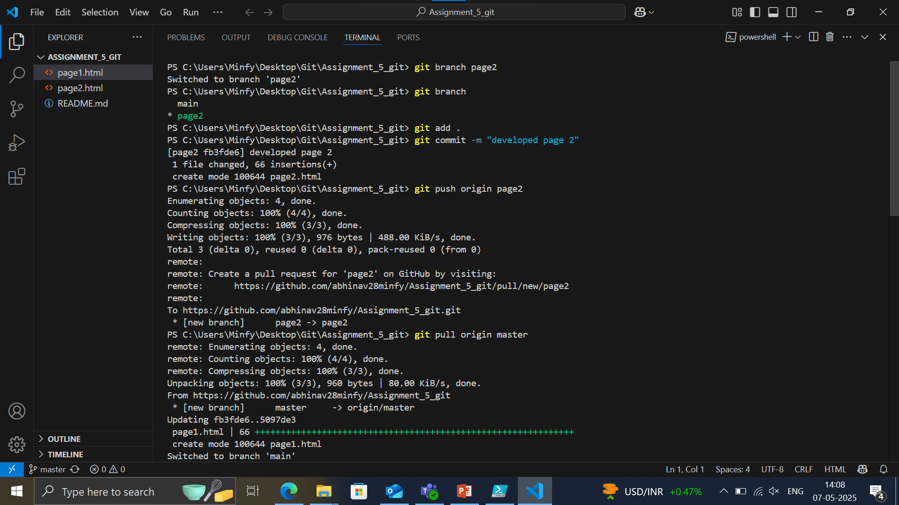
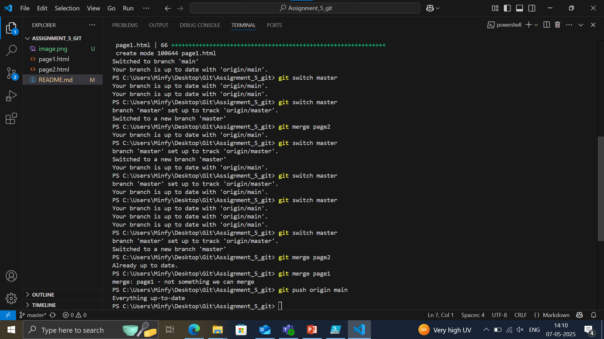
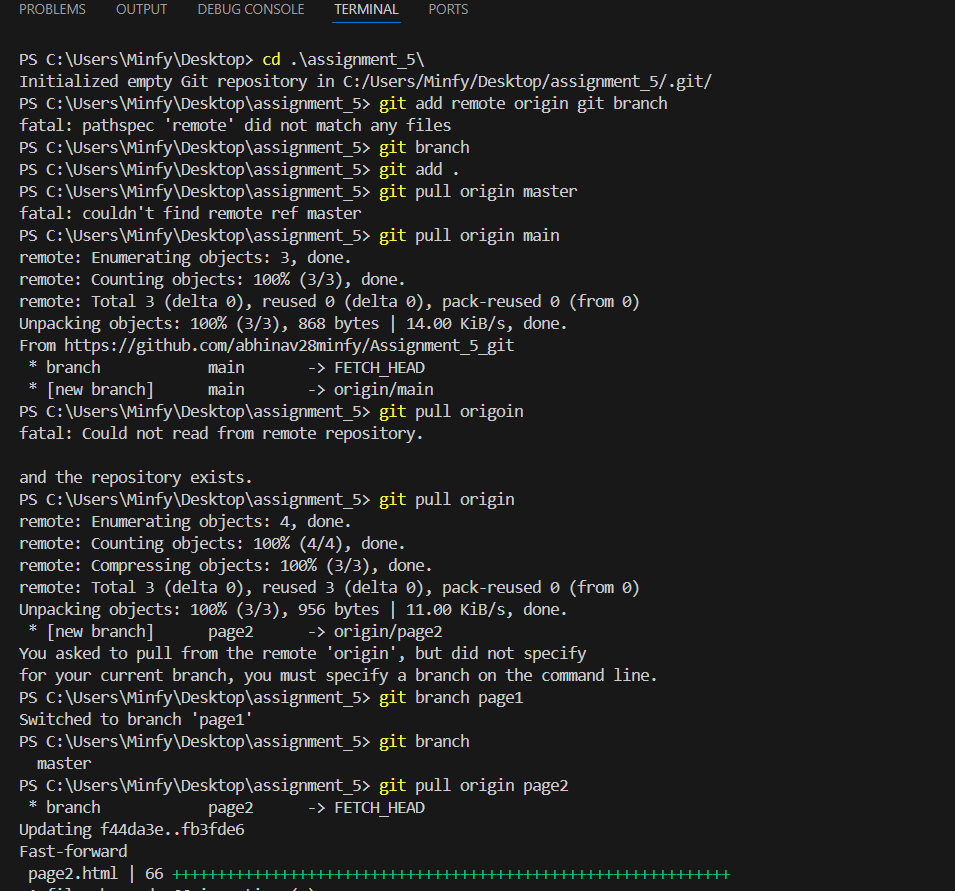
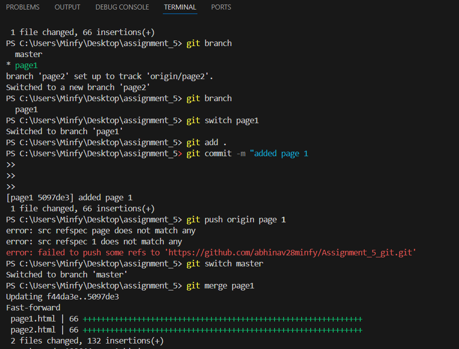
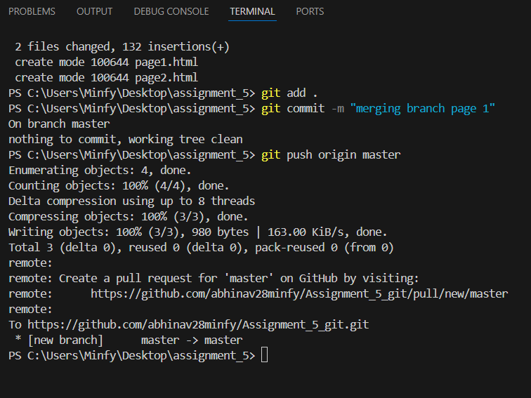
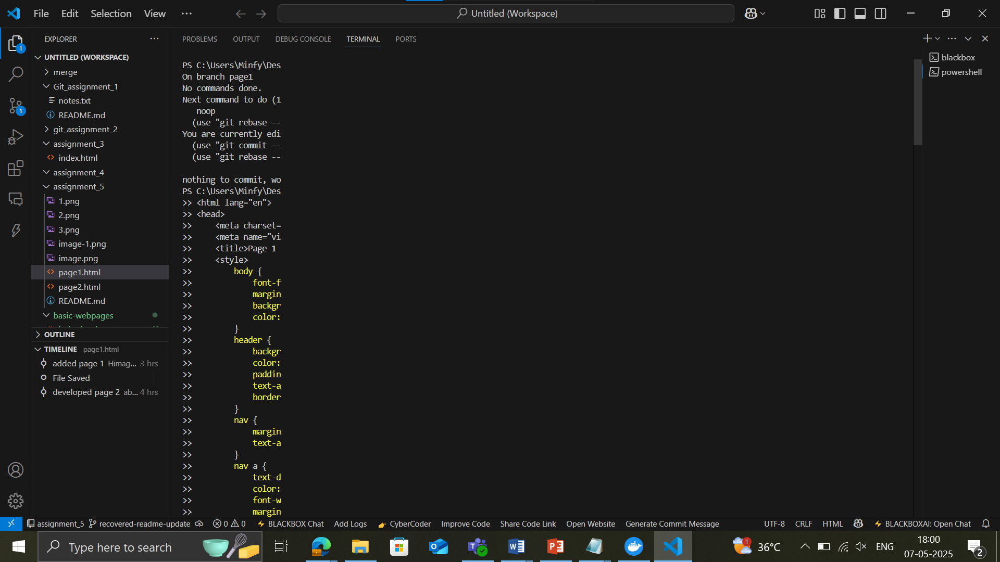
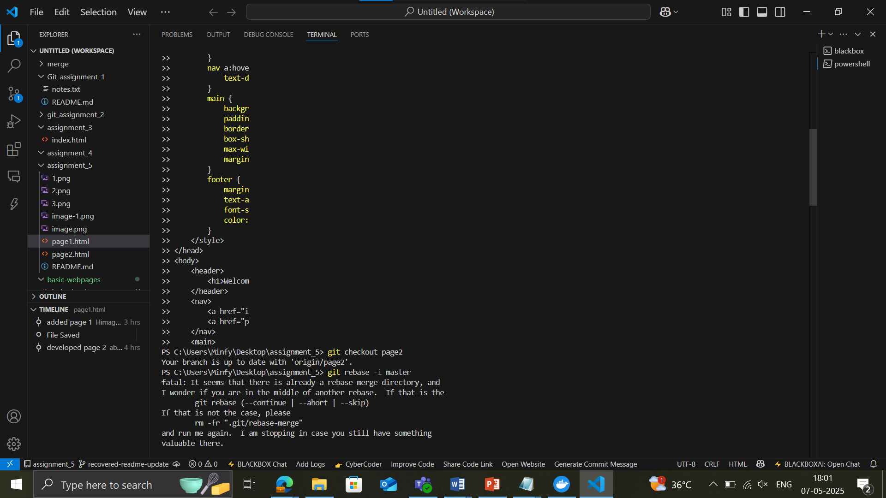
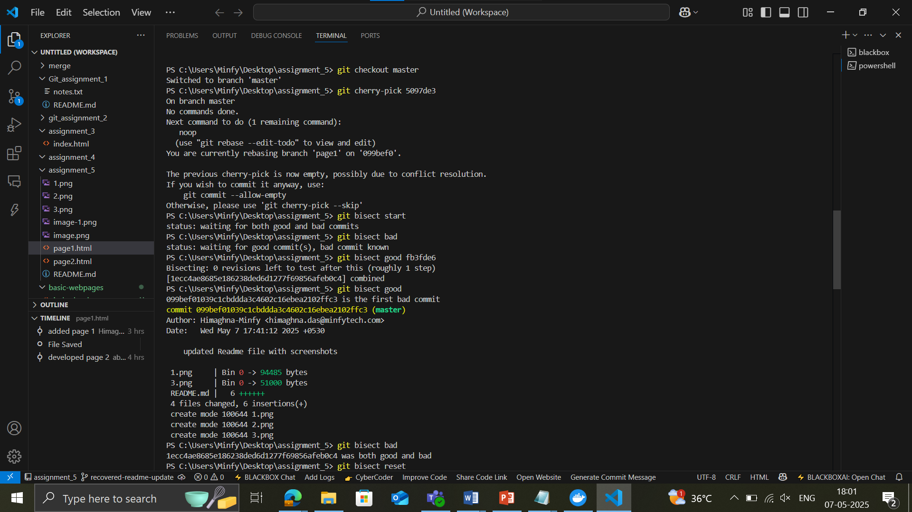
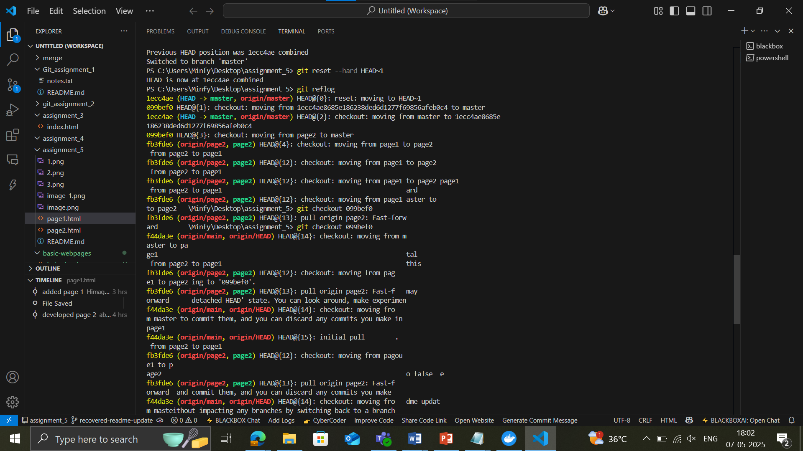
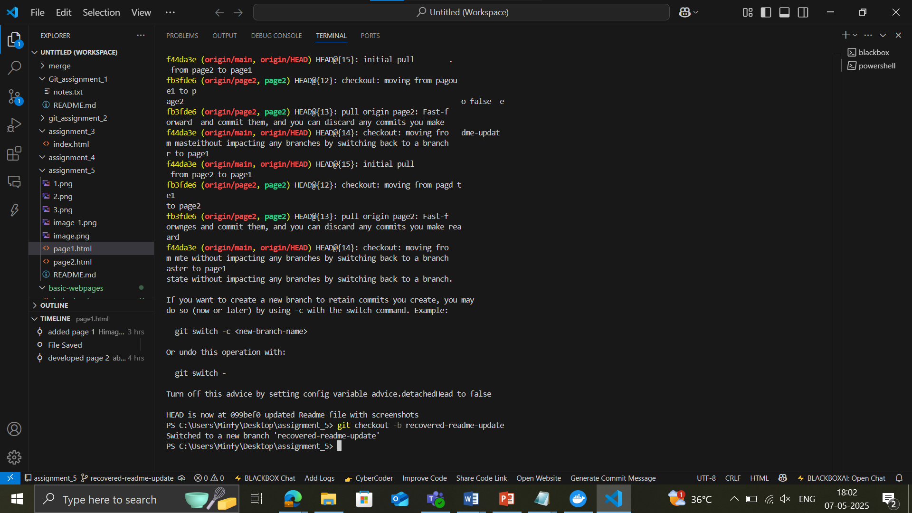

# Assignment_5_git

to be added by h__3

First I created a git repository and and added another member as a collaberator.
Cloned the repository to my system, and created a branch to implement page 2.
Similarly the other collaberator, did the same and started working on another feature branch.
After completing his work he merged his branch with the master branch and pushed it.
Once my feature was complete, I pulled his changes from the git repository, followed by merging my own branch to the master branch.

the above 3 images are added by Himaghna

